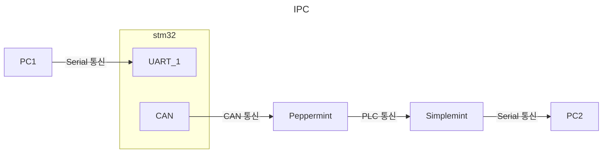

# 시스템 구성도

```mermaid
---
title: IPC
---

%%{init: {"flowchart": {"htmlLabels": false}} }%%
flowchart LR
    PC1[PC1] --Serial 통신--> UART_1

    subgraph stm32
    UART_1
    CAN 

    end
    CAN--CAN 통신-->PEP[Peppermint]
    PEP--PLC 통신-->SIM
    SIM--Serial 통신-->PC2
    SIM[Simplemint]
    PC2[PC2]
```
---
## 역활
- PC2 : 전기차 명령 입력
- Simplemint : 전기차 에뮬레이터
- Peppermint : PLC-2-CAN 통신 변환 장치
- STM32 : 전기차 충전기
- PC1 : 카드결제 에뮬레이터

##참조

- PLC : Power Line Communcation