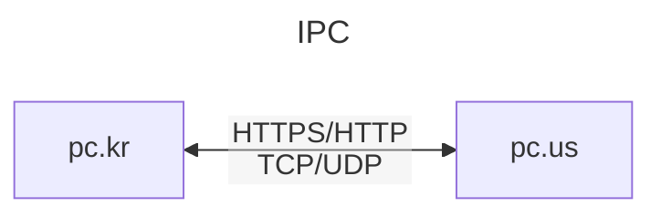
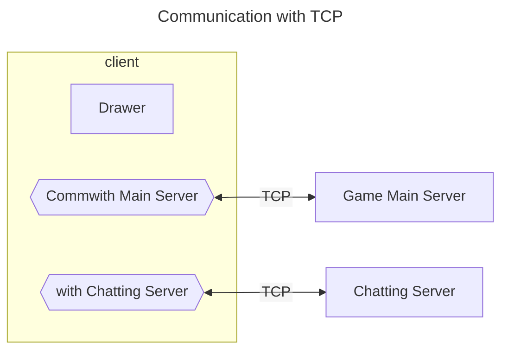
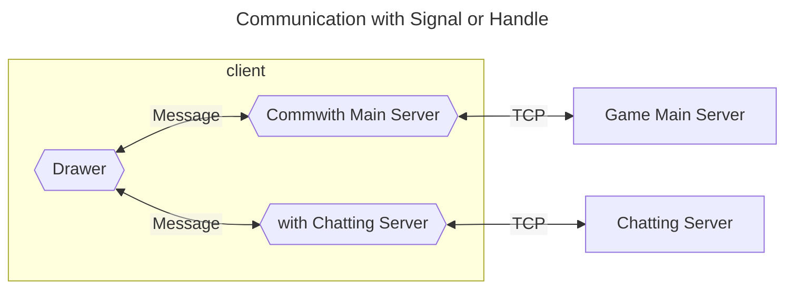

# 2024-06-02
1. ## 작업 내용

IPC : Inter=process Commcuication


*HTTP :  Hypertext Transfer Protocol
*HTTPS:
*UDP
*TCP


---
## Communication



---
## IPC(Inter-Process Communicaion)

###IPC 정리
- Linux : Signal, MsgQ
- Windows : Message, Singal
```
PostMessage
SendMessag  e
```


