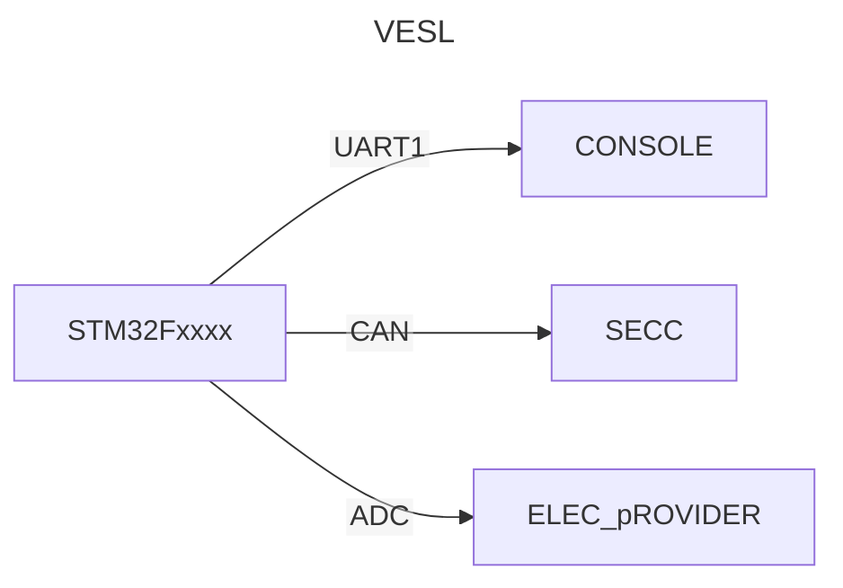

# 2024-06-02
1. ## 작업 내용


## 2. 참조
### UART 
- Universal Asynchronous Receiver Transmitter
```
UART는 비동기식 직렬 통신 표준으로, 두 개의 장치 간에 데이터를 한 번에 한 비트씩 전송하는 데 사용됩니다. 컴퓨터, 마이크로컨트롤러 및 기타 전자 장치에서 널리 사용되는 표준입니다.
```

### CAN
```
ㅁㄴㅇㄻㄴㅇㄻㄴㅇㄻㄴㅇ
```

### ADC
```
```

### 트랜시버 (Transceiver)
```
  일반적으로, 전송기(transmitter) 및 수신기(receiver)를 하나로 합친 장치 (즉,송수신기)
  이에는 무선 트랜시버, 광 트랜시버, 랜카드 트랜시버 등이 있음
  한편, `Transceive`이라면, 송신(transmit) 수신(receive) 모두를 가리킴'
```