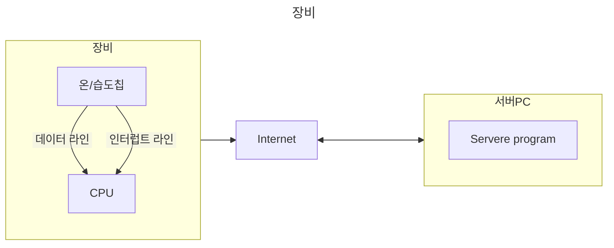

# Data Reading 방법

---

## CPU에서 데이터 읽기
    1.1 pollong 방식
        (설정된 시간 단위로 CPU가 데이터 읽음)
    1.2 Interrup 방식
        (인터럽즈 발생시 데이터 읽음)
    1.3 DMA 방식 [Direct Memory Access]
        (자동으로 데이터가 CPU 있는 메모리로 들어옴)
---
## 서버 PC
    1. 데이터 IN
    2. Callback function

Call back fucntion

