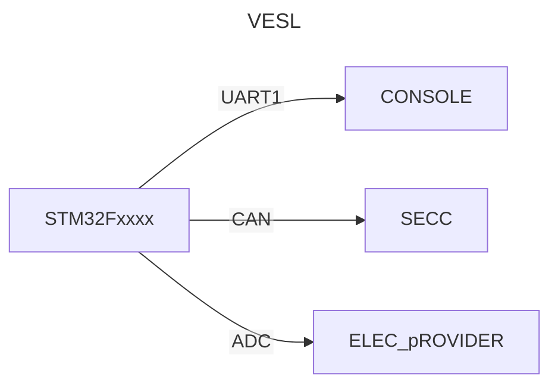

# 2024-06-02
1. ## 작업 내용


## 2. 참조
### UART 
- Universal Asynchronous Receiver Transmitter
```
UART는 비동기식 직렬 통신 표준으로, 두 개의 장치 간에 데이터를 한 번에 한 비트씩 전송하는 데 사용됩니다. 컴퓨터, 마이크로컨트롤러 및 기타 전자 장치에서 널리 사용되는 표준입니다.
```

### CAN
- 낮은 데이터 전송 속도: 최대 데이터 전송 속도는 1Mbps입니다.긴 메시지 지연: 긴 메시지 전송 시 지연이 발생할 수 있습니다.
- CAN 라인
  ```
  CAN H(CAN High): 데이터를 전송하는 데 사용되는 전선입니다.
  CAN L(CAN Low): 데이터의 보완을 전송하는 데 사용되는 전선입니다.
  ```
- CAN 프레임
  ```
  SOF (Start of Frame): 프레임 시작을 나타내는 1비트 필드입니다. 항상 0값입니다.
  ID (Identifier): 데이터 프레임의 식별자를 나타내는 11비트 또는 29비트 필드입니다. ID는 데이터 프레임의 우선순위를 결정합니다.
  RTR (Remote Transmission Request): 원격 프레임인지 여부를 나타내는 1비트 필드입니다. 0은 데이터 프레임, 1은 원격 프레임을 나타냅니다.
  DLC (Data Length Code): 데이터 필드의 길이를 나타내는 4비트 필드입니다. 최대 8바이트까지의 데이터를 전송할 수 있습니다.
  데이터 필드: 실제 데이터를 전송하는 필드입니다. 최대 8바이트까지의 데이터를 전송할 수 있습니다.
  CRC (Cyclic Redundancy Check): 데이터 오류를 감지하는 15비트 필드입니다.
  EOF (End of Frame): 프레임 종료를 나타내는 7비트 필드입니다. 항상 1값입니다
  ```
- CAN 프레임 종류
  ```
  데이터 프레임: 실제 데이터를 전송하는 프레임입니다.
  원격 프레임: 특정 데이터를 요청하는 프레임입니다.
  오류 프레임: 데이터 오류를 감지하거나 발생시키는 프레임입니다.
  ```
### ADC
```
```

### 트랜시버 (Transceiver)
```
  일반적으로, 전송기(transmitter) 및 수신기(receiver)를 하나로 합친 장치 (즉,송수신기)
  이에는 무선 트랜시버, 광 트랜시버, 랜카드 트랜시버 등이 있음
  한편, `Transceive`이라면, 송신(transmit) 수신(receive) 모두를 가리킴'
```